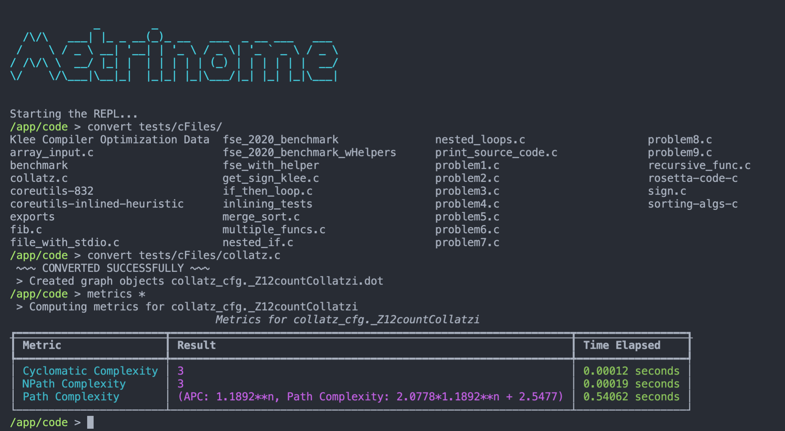

## Overview 

Metrinome is an all-purpose tool for working with code complexity metrics. It can be used as both a REPL and API, and includes:

- Converters to turn C++, Java, and Python code to Control Flow Graphs
- Metric calculators for NPath, Cyclomatic, and Path Complexity
- KLEE utilities to automatically analyze C++ code

To get started, follow the guide in the wiki to pull the docker image and jump directly into the REPL.

## Links

- **Documentation** https://github.com/hmc-alpaqa/metrinome/wiki

- **DockerHub** https://hub.docker.com/repository/docker/harveymudd/metrinome

- **Initial Paper** https://www.cs.hmc.edu/~bang/research/metrinome.pdf

